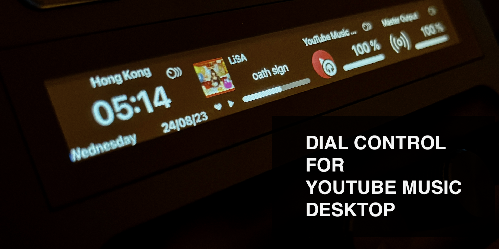
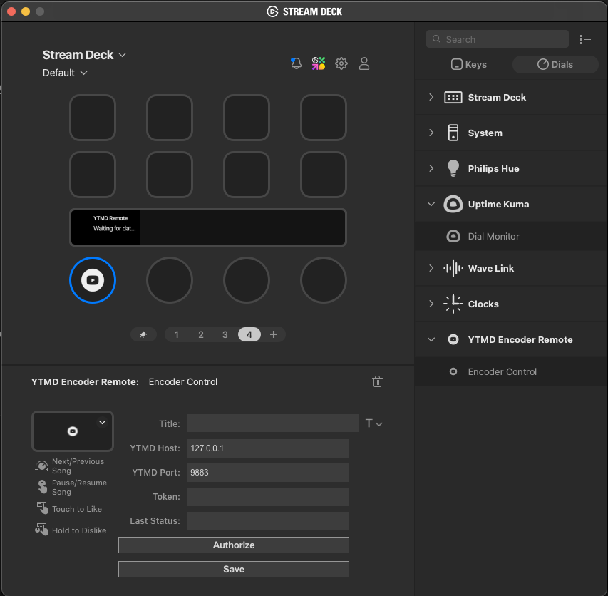
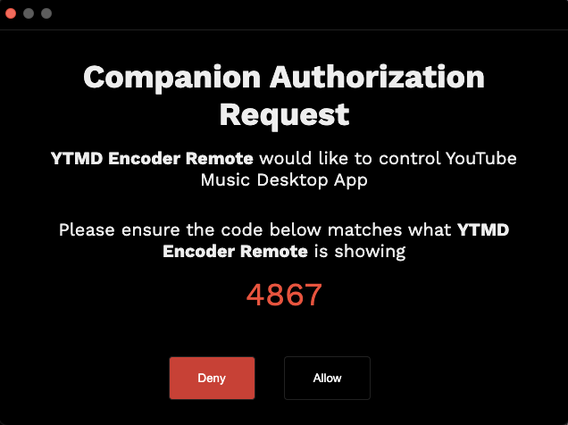

# About

This Stream Deck Plugin allows you to control the [YouTube Music Desktop App](https://github.com/ytmdesktop/ytmdesktop) on Streandeck Plus.

# Installation

1. Install the [YouTube Music Desktop App](https://github.com/ytmdesktop/ytmdesktop).
2. Install the Plugin from [Releases](https://github.com/levindecaro/streamdeck-ytmd-remote/releases) or from the official Stream Deck Store.
3. Add Actions to Stream Deck.
4. Activate the Companion Server / Remote control from YTMD App
    - Settings > Integration > "Companion Server" : ON
    - Settings > Integration > "Enable companion authoriztion" : ON (It will auto turn off after registration)
5. In SteamDeck YTMD Encoder Remote Setting, click "Authorize", an Authoriztion windows wil Pop Up, click "Allow" to register YTMD Encoder Remote into companion server.
6. Token will auto fill into the token input box.
7. Click "Save"

# Control

|   |   |
|---|---|
|Play/Pause| - Press the knob |
|Next Track| - Rotate Clockrise |
|Previous Track| - Rotate Anti-Clockrise|
|Like/Unlike Track| - Touch Screen Area Once|
|Dislike/Undo Dislike Track| - Touch and Hold Screen Area|
|   |   |

# Support / Feedback
Check the log file named *com.remote.ytmd0.log* under Steamdeck Log directory. Create a github issue if you found a bug.

# Reference and Thanks

https://github.com/samwho/streamdeck

https://github.com/XeroxDev/YTMD-StreamDeck

# Copyrights

Plugin icon owned by [Entyoo](https://www.entypo.com/) under Creative Commons Attribution 4.0 International Public License.
